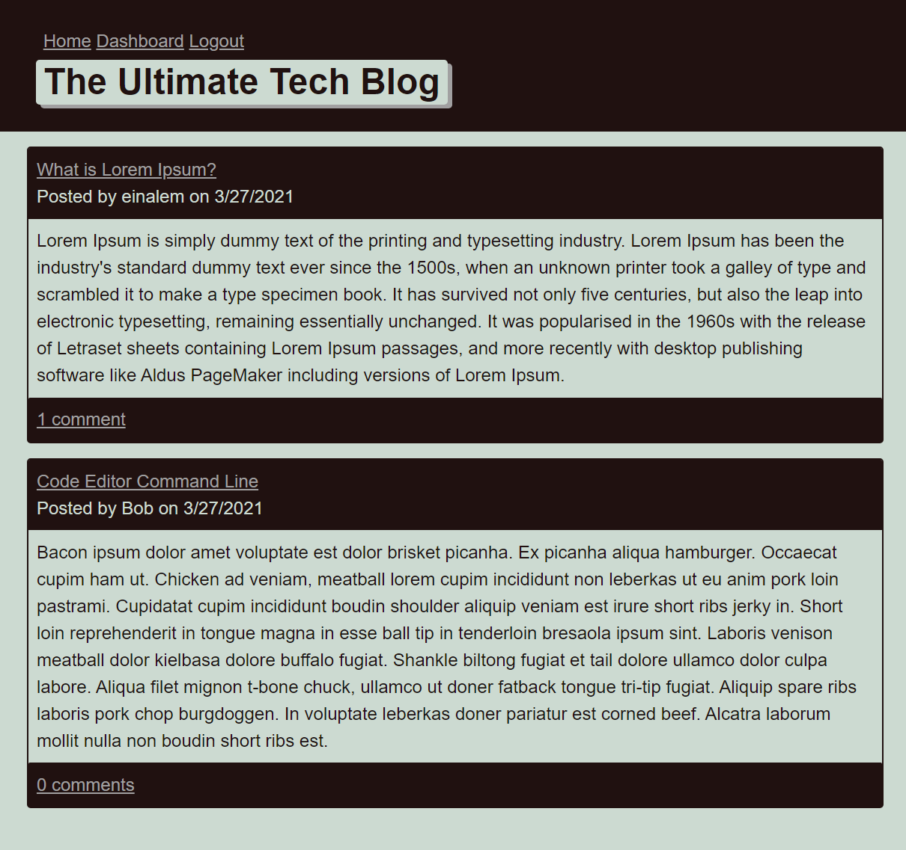

# The Ultimate Tech Blog

  

Check out the badges hosted by [shields.io](https://shields.io/).

## Description:

A CMS-style blog site similar to a Wordpress site, where developers can publish their blog posts and comment on other developers’ posts as well.

## Table of Contents

- [Preview](#preview)
- [Built With](#built-with)
- [License](#license)
- [Author](#author)

## Preview:
[Live Site](hhttps://ultimate-tech-blog.herokuapp.com/)

## Built With:

[Sequelize](https://sequelize.org/v5/)

[Handlebars.js](https://handlebarsjs.com/)

## License:

## Author

Melanie Arnold